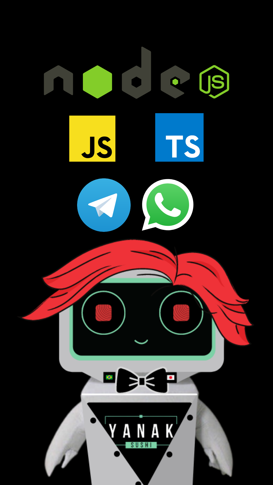

 

# Yan bot

<p>
  
  
  
  <a href="https://opensource.org/licenses/ISC">
    
  </a>
</p>

## Tópicos

[Sobre o Yan Bot](#sobre-o-yan-bot)

[Tecnologias](#tecnologias)

[Funcionalidades](#funcionalidades)

[Instalação e uso](#instalação-e-uso)

[Licença](#licença)
<br>

## Sobre o Yan bot

- 🧠 O Yan é uma inteligêcia artificial que usa Machine learning e NLP (natural language processing). 
- 🌎 Ele é poliglota e suporta 40 idiomas nativamente e 104 idiomas através de integração BERT.
- 👨‍🚀 Nascido com o propósito de entender as intenções dos clientes e oferecer um resposta rápida e eficaz, quato mais voê conversar com Yan mais ele aprende e melhora a experiência do usuário.
- 🤘 Este projeto conta com ajuda da comunidade open source do Brasil e do mundo.
<br>

<p align="center">
    
</p>

## Tecnologias

Tecnologias e ferramentas utilizadas no desenvolvimento do projeto:

- [TypeScript](https://www.typescriptlang.org/)
- [Axios](https://github.com/axios/axios)
- [Node-nlp](https://www.npmjs.com/package/node-nlp)
- [Pino](https://www.npmjs.com/package/pino)
- [Venom-bot](https://orkestral.github.io/venom/index.html)
<br>

## Funcionalidades

|                                                               |   |
|---------------------------------------------------------------|---|
| 🚻 Atumoático QR Refresh                                      | ✔ |
| 📁 Evia  **texto, imagem, vídeo, áudio e documentos**         | ✔ |
| 👥 Pega **contatos, chats, grupos, membros do grupo**         | ✔ |
| 📞 Envia contatos                                             | ✔ |
| 🆘 Envia Botões                                               | ✔ |
| 💞 Envia stickers                                             | ✔ |
| 🤸‍♀️ Envia GIF                                                  | ✔ |
| 🤹‍ Multiplas sessões                                          | ✔ |
| ⏩ Acelera messages                                           | ✔ |
| 📥 Recebe messages                                            | ✔ |
| 👤 Insere sessão de usuário                                   | ✔ |
| 📍 Envia localização                                           | ✔ |
| 🛍 Envia promoção do dia                                       | ✔ |
|🤳 Envia menssagem via telegram caso não entenda a intenção do usuário | ✔ |
| **🆙 e muito mais**                                           | ✔ |


## Instalação e uso

```bash
# Abra um terminal e copie este repositório com o comando
git clone https://github.com/helton-quintans/yan-bot.git
# ou use a opção de download.

# Entre na pasta web com
cd yan-bot

# Instale as dependências
yarn install

# Rode a aplicação
yarn dev
```

<br>

## Licença

<a href="https://opensource.org/licenses/ISC">
    
</a>

<br>

Esse projeto está sob a licença ISC. Veja o arquivo [LICENSE](/LICENSE) para mais detalhes.

---

Feito com :green_heart: by [Helton Quintãns](https://github.com/helton-quintans)

[](https://www.linkedin.com/in/heltonquintans/)
[](mailto:helton.quit@gmail.com)
>>>>>>> main
